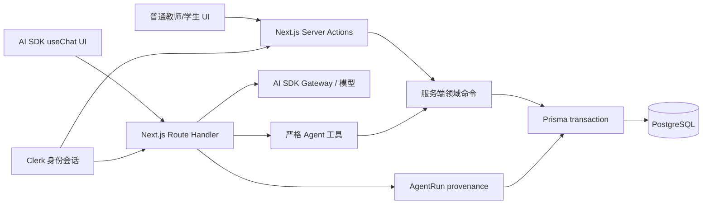

# CDAS Next 实现架构

状态：手工六步闭环与活动助手试行实现基线；真实外部验收待完成
日期：2026-08-20

## 运行时边界

普通 UI 和 Agent 的入口不同，但最终调用相同的领域命令。Agent 不拥有独立权限，也不能导入 Prisma 或直接执行存储操作。

入口把表单或工具参数与可信 `CommandContext` 分开。业务输入不能包含 actor、调用来源、追踪号或当前时间；UI context 由 Clerk 会话、服务端 trace 和服务端时钟构造。测试只能通过不可序列化的 `clock()` 依赖固定时间，不能给生产表单增加 `now` 参数。

## 模块职责

| 位置 | 职责 | 禁止 |
| --- | --- | --- |
| `src/app/` | 页面、表单、结构化确认和导航 | 直接访问 Prisma、相信客户端角色或确认参数 |
| `src/domain/` | Zod 合同、纯不变量、内容快照和可确定测试 | 框架会话、数据库连接、模型调用 |
| `src/server/commands/` | 重新授权、乐观并发、事务、幂等和审计 | 将外部网络调用放进数据库事务 |
| `src/server/db/` | Prisma 连接生命周期 | 业务规则 |
| `prisma/` | 模型、migration、数据库约束和数据库测试 | 依赖页面状态或 Prompt |

## 发布事务

`publishActivityRelease` 在 Serializable 事务中执行：

1. 查询 `(actor, command, idempotency_key)`；相同请求返回首次结果，不同参数返回冲突。
2. 读取已确认 ActionIntent，校验 actor、参数摘要、有效期和未消费状态。
3. 重新读取精确草稿修订与目标班级，验证所有权、管理关系、状态和版本。
4. 原子消费确认并封存草稿。
5. 创建 ActivityRelease 与一对一不可变快照。
6. 保存成功审计与幂等结果，然后提交事务。

越权、确认过期、草稿变化或参数篡改不会产生 Release；失败结果另行写入 append-only 审计。PostgreSQL 唯一约束和 Serializable 重试处理并发重复请求。

ActionIntent 的 action、payload、hash、目标、预期版本、创建者和有效期在插入后由数据库 trigger 永久冻结；状态只能 `prepared → confirmed/rejected/expired` 或 `confirmed → executed/expired`。确认审计同时绑定 payload hash，不能把整组参数换成另一组内部一致的数据。

## 活动草稿保存与发布预备

- `saveActivityDraft` 同时服务普通教师 UI 与 Agent 工具。新建从版本 1 开始；每次保存以 `draftId + expectedVersion` 做 CAS，更新可变 head 并追加内容完全一致的 ActivityDraftRevision。
- UI 保存记录为 `MANUAL` 且不能携带 AgentRun；新的 Agent 保存必须绑定同一教师、状态为 RUNNING 的 AgentRun。SUCCEEDED 运行只可精确重放原幂等结果，FAILED/CANCELLED 不可继续写入。
- 幂等摘要包含可信调用来源，UI 的成功结果不能被 AGENT 用同一 key 伪装成 Agent 写入，反之亦然。
- `preparePublishActivityIntent` 只在教师拥有草稿、仍管理目标班级、版本精确且状态为 READY_FOR_PREVIEW 时创建十分钟 ActionIntent。它不封存草稿，也不创建 Release。
- 第一方 `decideActionIntent` 确认后，既有 `publishActivityRelease` 才重新授权、消费意图、封存同一版本并创建同源快照。

数据库在提交时要求草稿版本从 1 连续、head 内容等于当前不可变修订；只允许 READY 草稿在正文和版本不变时由发布事务变为 SEALED。每个 Release 还必须以唯一外键绑定已执行的发布 ActionIntent；ActionIntent、SEALED 草稿、Release 与精确快照由双向延迟约束要求在同一事务完整出现。快照 JSON 必须等于绑定版本的完整修订，摘要由 PostgreSQL 17 核心 SHA-256 对固定 schema-v1 canonical UTF-8 字节重新计算，不信任调用方传入的 64 位字符串。

## 学生文本提交流程

- `saveSubmissionWorkingCopy` 保存可为空的工作内容，以工作副本 UUID + version 做 CAS。
- `submitSubmissionRevision` 不接收正文，只复制学生精确确认的已保存工作副本；提交后删除该工作副本并追加不可变修订。
- `startSubmissionResubmission` 显式从当前正式修订创建新工作副本；重复请求返回现有副本，不重置学生修改。
- 三个命令都重新验证当前班级成员关系与 active Release。超过截止时间但仍 active 时允许提交，并把 late 固化在修订上。

数据库在事务提交时校验 Submission 最新指针、连续修订序列和可选工作副本 base 是否一致；容器身份不可改，正式修订不可更新或删除。

## 发布关闭事务

`closeActivityRelease` 只在第一方 UI 使用，且仅允许发布教师仍为目标班级管理员时执行：

1. 查询 `(actor, command, idempotency_key)`；相同请求返回首次关闭结果，不同参数返回冲突。
2. 读取已确认 ActionIntent，校验 actor、Release、预期 `ACTIVE` 状态、参数摘要、有效期和未消费状态。
3. 在 Serializable 事务内重新读取 Release 与目标班级管理关系；只有仍为 `ACTIVE` 的精确 Release 可以继续。
4. 原子消费确认，将 Release 迁移为 `CLOSED`、保存其唯一关闭 ActionIntent 关联，并保存成功审计与幂等结果后提交。

数据库用 Release 更新与关闭 ActionIntent 执行的双向延迟约束，拒绝没有精确确认、actor、参数摘要和执行时间的直接状态修改。关闭后学生写命令在重新授权时拒绝，已有 Release、学生自己的提交和反馈仍可读取，且有权教师仍可反馈。第一阶段不实现 `CLOSED → ARCHIVED`，也不提供关闭的 Agent 工具。

## 教师反馈确认流程

- `prepareTeacherFeedbackIntent` 读取学生当前正式修订与反馈版本，规范化反馈正文，并创建十分钟有效、绑定精确 Submission 修订和正文摘要的 ActionIntent。
- 第一方 UI 通过 `decideActionIntent` 记录教师本人确认；AI 建议本身不构成业务反馈。
- `saveTeacherFeedback` 锁定 Submission 后重新授权并核对当前修订。学生若已经重交，原确认失效且不会产生反馈。
- 每个 SubmissionRevision 对应一个稳定 TeacherFeedback 容器；首次确认创建版本 1，之后修改只追加 TeacherFeedbackRevision 并以容器版本做 CAS。
- 手写路径不创建 AgentRun，也不调用模型；关闭 AI provider 时仍能完成确认与保存。

数据库同时校验反馈容器身份、连续版本、确认时间、正文可见性、来源 provenance，以及不可变修订与已执行 ActionIntent 的精确对应关系。

## 活动助手试行

- “新建学习活动”是助手会话的唯一起点。`/teacher/activities` 共享客户端 layout 持有唯一官方 `useChat` session，使草稿工具返回后的客户端导航可以在精确预览页继续同一消息与签名 approval；直接进入或刷新预览页时 session 为空，页面不伪造恢复。消息、prompt、ticket 与 approval 签名不进入 URL、localStorage 或业务数据库，导航到 Release 后 layout 卸载。Server Component 仅在 `AI_PROVIDER_DISABLED=0` 且 Gateway、模型和审批签名配置全部有效时渲染助手；这个检查不构造 provider，也不创建 AgentRun。
- Route Handler 先从 Clerk 会话解析应用教师，再严格校验消息数量、总字节、角色顺序、文本长度和 AI SDK 工具 part。学生、未配置账号和伪造历史不能进入 provider 或业务工具。
- AI SDK 官方 `useChat + streamText` 负责消息流与工具 part，不维护第二套聊天协议。模型调用始终在数据库事务之外；请求正文、Prompt、工具正文和 provider 原始 chunk 不写日志或 tracing。
- `create_activity_draft` 复用 `saveActivityDraft`，以当前教师、`AGENT` 来源和 owned RUNNING AgentRun 保存严格六段内容。成功输出包含精确 draft ID 和站内路径；客户端只在两者一致时进入预览。
- `publish_activity_release` 先由 AI SDK 签名 `toolApproval` 暂停交互；教师批准后仍依次调用发布 prepare、第一方 UI decide 与原有 publish command。ActionIntent 才是精确参数、资源版本、确认人和重新授权的业务信任边界。
- 普通模型工具写入由 AI SDK `stopWhen` 在该工具 step 后结束。`saveActivityDraft` 与 `publishActivityRelease` 的 Agent 路径会在同一领域事务提交业务结果、成功审计、幂等结果与 AgentRun 的 `RUNNING → SUCCEEDED`；若运行已经失败或取消，事务整体回滚。签名审批续传会先执行已批准工具，成功后再由官方 `prepareStep` 给后续 provider adapter 一个已中止 signal；后续流或连接失败不能把已提交业务事实改写成失败。模型在工具前中断不会创建草稿、Release 或反馈。
- 同一工具调用可由命令幂等重放。若整个 HTTP 请求在确认执行后丢失并以新的 AgentRun 原样重建，当前会安全地返回幂等冲突，而不是弱化 AgentRun provenance；跨运行恢复仍是明确的可用性缺口。
- 新 Agent 写入只接受同一教师拥有的 RUNNING run；SUCCEEDED run 只允许命中原 IdempotencyRecord 的精确重放。数据库同时禁止 AgentRun 身份改写、终态回拨、删除及审计外键置空。
- 远端首场景验收使用独立 `staging-agent-acceptance` 门禁：AI-enabled health proof 绑定源码、部署、DB、Clerk、Gateway key 指纹、模型和 approval secret 指纹；runner-side ticket 只驻内存；marker namespace 只追加；浏览器后由 read-only SQL 精确验证三次 SUCCEEDED AgentRun、AGENT revision、ActionIntent、Release/snapshot、audit、idempotency 和零学生历史。该门禁不部署、不迁移、不清理，也从不产生 production GO。

## 不可变历史

下列数据只允许追加：

- ActivityDraftRevision
- ActivityReleaseSnapshot
- ActivityRelease 的身份、发布时间、目标班级与截止时间
- SubmissionRevision
- TeacherFeedbackRevision
- 成功 IdempotencyRecord
- ActionAudit

初始 migration 使用数据库 trigger 拒绝对已存在行的更新或删除。页面隐藏按钮、TypeScript 类型和 ORM 调用约定都不能替代数据库约束。

每个 Release 在事务提交时必须恰有一个同源 Snapshot；复合外键保证两者引用同一草稿。Release 只能 active → closed → archived，不能重新打开或跳级；第一阶段只由第一方 UI 执行 active → closed，archived 留待未来。

## 外部服务原则

- Clerk 只回答调用者身份。角色、班级成员关系和资源归属保存在 PostgreSQL。
- AI SDK 的签名 `toolApproval` 只负责交互暂停与响应验签；ActionIntent 绑定精确参数、版本和确认人。
- 模型失败不能阻止普通教师和学生流程；默认可以通过 `AI_PROVIDER_DISABLED=1` 完全关闭。
- 后续附件切片才会引入私有对象存储、随机 key、短时预签名 URL 和托管恶意文件扫描；对象 URL 不能作为权限凭证。
- 日志与 tracing 默认不记录完整 Prompt、学生证据、反馈正文或附件内容。
